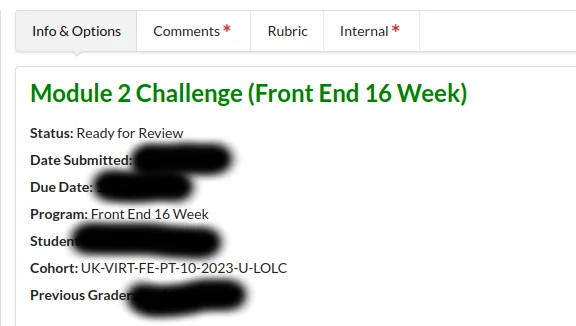
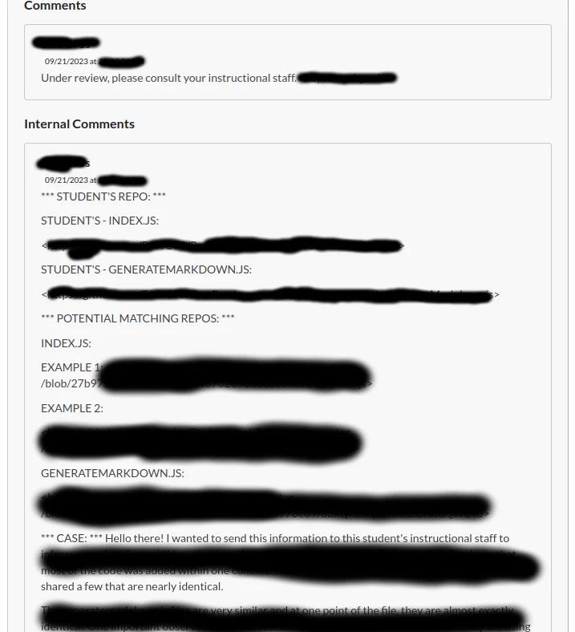
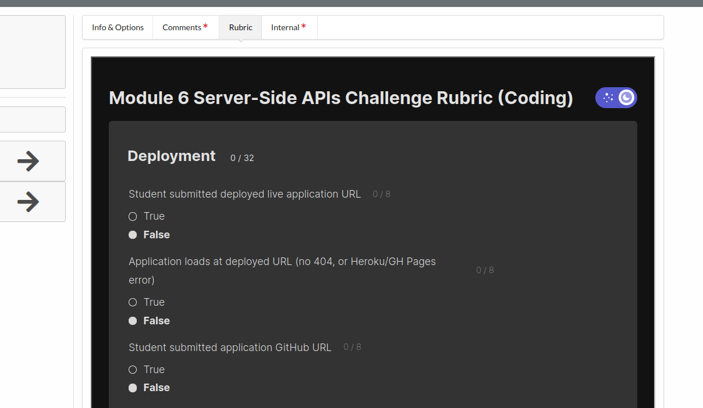

# Grader Fixer

## SUMMARY
Several scripts to improve the usability of the grader platform. You can pick and choose which scripts you want to use.

## USAGE
The usage of these scripts requires the Tampermonkey browser extension for Firefox or Chrome.

Firefox: https://addons.mozilla.org/en-US/firefox/addon/tampermonkey/

Chrome: https://chrome.google.com/webstore/detail/tampermonkey/dhdgffkkebhmkfjojejmpbldmpobfkfo

After installing the extension, open it and create a new script. Then just delete all of the boilerplate and copy/paste the entire script that you want to use from this repository. Make sure that you leave the commented code at the top, as this will detect the webpage. After this, the updates should be applied once you refresh the page. All scripts are independent of each other, so you can pick and choose which ones you want to use.

## SCRIPTS
### assignmentPage.js
1. Comments in "Related Submissions" are split into paragraphs (as originally written) for ease of reading.
2. "Program" now shows the correct program instead of always showing "Full Stack Flex".
3. Program (Full Stack Flex or Front End 16 Week) is displayed next to module name.
4. Module name and program are color coded to quickly and automatically recognize which one it is.
    1. Full stack flex is blue
    2. Front End 16 Week is green
5. When large images are uploaded by the student they are shrunk to fit their container rather than overflowing.

### rubric.js
1. Adds rubric to the "Rubric" tab. (Automatically determines full stack vs. front-end and module)
2. Increases width of right-hand section of page to make more room for rubric.

### saveGraded.js
1. Every time an assignment is grade, some data about it is saved to local storage.
2. Adds button to top left of screen that allows you to download a CSV file with all graded assignments in it.
3. No sensitive data is saved and all data is saved to user's browsers. No data leaves the browser until CSV is downloaded.
4. Data saved:
    1. Submission ID from URL
    2. Module number
    3. Grade assigned
    4. Date/time submitted

## BUGS
If you run into any problems or bugs, please submit an issue on GitHub. https://github.com/MorganLee909/grader-fixer/issues

## Updates
20230901: Website was updated and caused more problems with the claimed/active queue for graders. On top of the assignments being spread out across multiple tabs as usual, I had assignments flash in and out. It would display some assignments, then quickly change, then maybe change again, making it completely unusable. Also, they changed the backend which made the script not work properly. This update addresses that, so it should be working as normal. There is also a minimized script now, it is only about half of the size.

20231101: Modularized the scripts so that graders can pick and choose which functionality they want to add. Old script still available if wanted. Added a script that will help display the Related Submissions in a more readable manner and also prominantly displays which course the submission is from. Did not add script for displaying assignments in "Claimed by me" section as I believe that this has been mostly fixed.

## Examples

